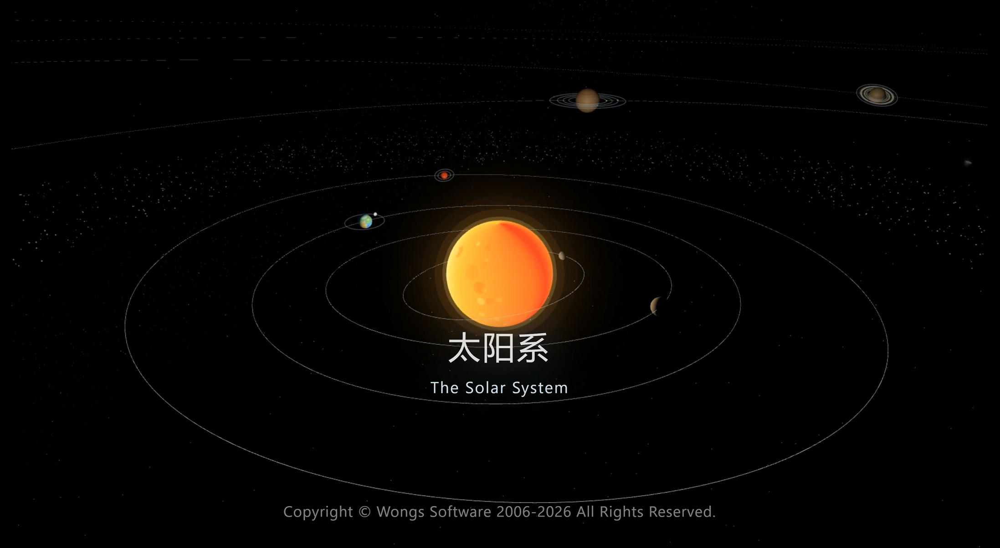

# 🪐 太阳系数字孪生：全景星空运行引擎 (AstroMotion-3D)

---

本项目是一款基于原生 WebGL (Three.js) 深度开发的 3D 太阳系动态沙盘引擎。有别于传统的“匀速圆周”三维动画演示，本引擎采用了**“双轴时空解耦架构”**，将极客级别的渲染性能优化与严谨的开普勒天体力学相融合，在浏览器端构建了一个物理精确、视觉宏大的全景星际数字孪生体。

## ✨ 核心特性

### 🔭 纯正的天体力学内核
拒绝刻板的视觉欺骗，模型底层完全以真实的物理方程驱动天体运行：
* **开普勒动态还原**：依托牛顿迭代法求解开普勒方程中的偏近点角，完美重现了行星“近日点加速、远日点减速”的开普勒第二定律。
* **高精度轨道构建**：全面引入椭圆轨道偏心率（e）与轨道倾角（inc），在三维坐标系中构建出真实的黄道面倾斜姿态。
* **严谨的自转与引力物理**：内置真实的行星自转轴倾角（axialTilt），底层支撑了天王星的“躺转”与金星的“逆向倒转”；实现了卫星体系的潮汐锁定（tidalLock），自转与公转的引力耦合一目了然。

### ⚙️ 工业级渲染与架构优化
针对海量星空与轨道管线的生成，引擎实施了极为苛刻的内存与性能管控：
* **极限 Draw Call 压榨**：摒弃低效的外部大图加载方案，重度依赖 BufferGeometry 与纯代码生成的自定义 CanvasTexture 进行材质渲染，极大降低了显存占用与网络开销。
* **千万级实例同屏**：在小行星带的构建中，采用工业级 3D 优化标准 InstancedMesh 实例化渲染技术，确保 2500+ 颗小行星在同屏运转时依然保持丝滑的高帧率。

### 🌌 兼顾科学与美学的空间体验
* **双轴时空解耦**：创新性地将“宏观公转尺度”与“微观自转尺度”进行参数剥离，彻底解决了 3D 天文模拟中常见的“时空佯谬”问题。
* **非线性视觉重映射**：采用对数与非线性缩放算法（体积放大、距离压缩），在物理真实度与大屏视觉观赏性之间找到了绝佳的平衡点。
* **学术级文本校对**：UI 界面、数据面板及所有星体标签，均经过严谨的天文专有名词与学术语法双重校对。

---

## 📚 核心领域词汇表 (Glossary)
为了方便开发者阅读源码和参与贡献，以下是本项目底层架构中涉及的核心天文学术语映射表：

### 1. 轨道力学 (Orbital Mechanics)
| 变量/属性 | 英文名词 | 中文释义 | 代码实现意义 |
| :--- | :--- | :--- | :--- |
| `a` | Semi-major Axis | 轨道半长轴 | 决定行星距离太阳的基准距离及轨道环大小。 |
| `e` | Eccentricity | 偏心率 / 离心率 | 描述轨道偏离正圆的程度，用于推导非匀速运动。 |
| `M` / `E` | Mean / Eccentric Anomaly | 平近点角 / 偏近点角 | M 为线性时间变量；通过 M = E - e * sin(E) 求解 E，驱动真实动态。 |
| `inc` | Orbital Inclination | 轨道倾角 | 轨道面与黄道面的夹角，决定 3D 空间中的上下倾斜。 |

### 2. 姿态与动力学 (Kinematics & Dynamics)
| 变量/属性 | 英文名词 | 中文释义 | 代码实现意义 |
| :--- | :--- | :--- | :--- |
| `axialTilt` | Axial Tilt / Obliquity | 自转轴倾角 | 实现天王星“躺转”和金星坐标系翻转的底层参数。 |
| `tidalLock` | Tidal Locking | 潮汐锁定 | 约束卫星自转与公转周期 1:1 同步（永远以同一面朝向母星）。 |
| `dir: -1` | Retrograde Rotation | 逆向自转 | 修正金星、天王星在视觉上的真实顺时针旋转。 |

---

## 🚀 快速开始 (Quick Start)

本项目为纯前端架构，零环境依赖，开箱即用。

1. **克隆项目**
   git clone https://github.com/YourUsername/AstroMotion-3D.git

2. **启动本地服务**
   由于涉及到 ES6 Module 和本地纹理的加载，请务必在本地搭建 HTTP 服务（不要直接双击打开 HTML）。
   你可以使用 VS Code 的 Live Server 插件，或者使用 Python/Node.js 快速启动：
   
   # 使用 Python 3
   python -m http.server 8080
   
   # 或者使用 Node.js (需全局安装 http-server)
   npx http-server

3. **访问沙盘**
   打开浏览器访问 http://localhost:8080 即可体验。

## 🛠️ 技术栈
* [Three.js](https://threejs.org/) - 底层 3D 渲染引擎
* HTML5 Canvas API - 程序化纹理生成
* 原生 JavaScript (ES6+) - 物理矩阵与数学迭代求解

## 🤝 参与贡献
欢迎提交 Issue 和 Pull Request！无论是优化底层引力摄动算法，还是补充更多的深空天体数据，我们都非常期待你的加入。

## 📄 开源协议
**Copyright © 2026 AiWoNGs SOFTWARE.**

本项目采用 [AGPL 3.0 License](https://www.gnu.org/licenses/agpl-3.0.html) 协议开源。
